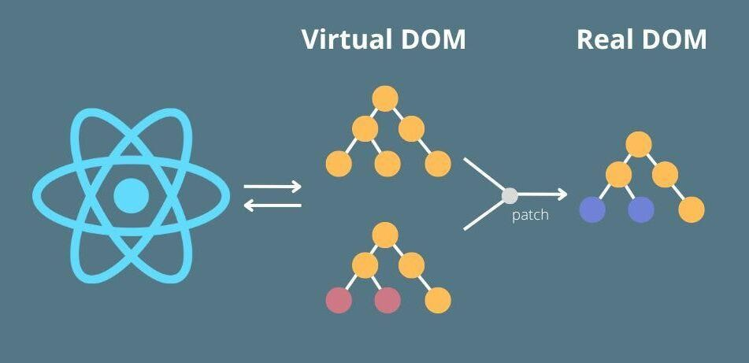

# React

## Iniciar el desarrollo de un proyecto de react

```sh
npm create vite@latest ./ # 1. react - 2. javascript
npm i
npm run dev
```

## Documentación oficial y links

<https://es.react.dev/>
<https://es.legacy.reactjs.org/>
<https://chromewebstore.google.com/detail/react-developer-tools/fmkadmapgofadopljbjfkapdkoienihi>

## JSX

<https://es.legacy.reactjs.org/docs/introducing-jsx.html>

## Virtual DOM



<https://es.legacy.reactjs.org/docs/faq-internals.html>

## Linter y configuracion de React en VITE

* usernamehw.errorlens
* dbaeumer.vscode-eslint

## Extensiones fundamentales para el trabajo con REACT

* dsznajder.es7-react-js-snippets

## Bootstrap (Framework - html - css - javascript)

<https://getbootstrap.com/>

```sh
npm i bootstrap@5.3.3
```

## Para que bootstrap funcione, tengo que colocar el script y la hoja de estilos

> index.css

```css
@import 'bootstrap';
```

> main.js

```js
import * as bootstrap from 'bootstrap'
```